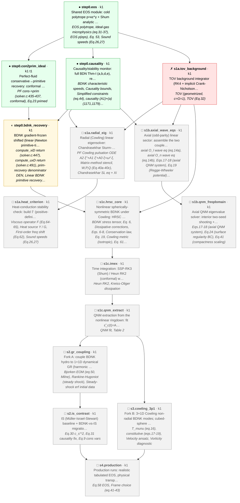

# Equation DAG — paper_bdnk-hmns

16 nodes. Legend: ● solid · ◐ preliminary · ○ hypothesis · ✗ blocking · □ future · △ concept-advance. Node badge `k<N>` = knowledge records under the node, `t<N>✗<F>` = trials (F failed). Dashed edge = predecessor outside scope.

